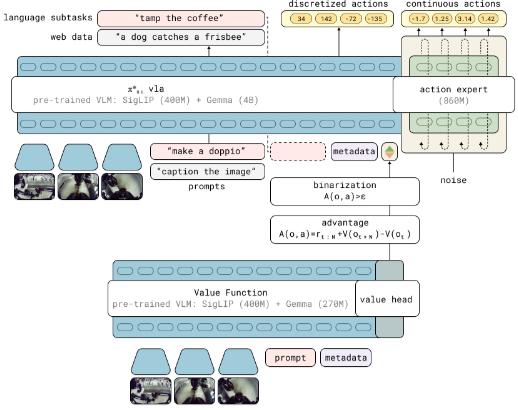
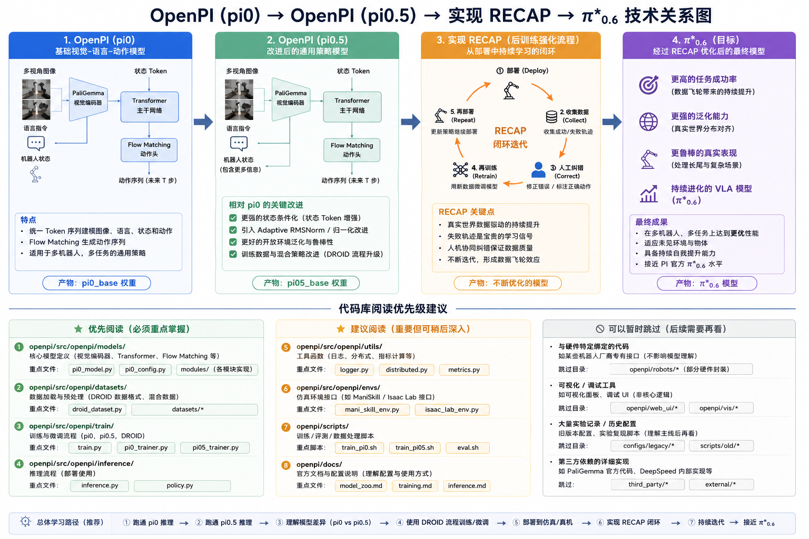

# day1 学习内容
1. 阅读pi*0.6文章[π∗0.6: a VLA That Learns From Experience] (https://arxiv.org/pdf/2511.14759)
2. 整理笔记，梳理一下文章实现思路 ,文章的主要内容实现思路
3. 确定项目的实现实现路径：OpenPI(pi0)→OpenPI(pi0.5)→IsaacLab / RLBench验证→DROID数据微调→实现RECAP→得到自己的π*0.6 
4. 代码没开源，将目光转向SimpleVLA-RL